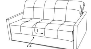
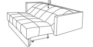
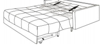
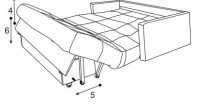
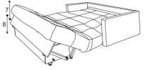
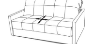

[< К содержанию](./readme.md)

## Порядок трансформации дивана

|Фото  | Наименование|  
|------------- | -------------|
|  | БРАТЬСЯ РУКОЙ ВСЕГДА НУЖНО НЕ ЗА НИЗ ЦАРГИ ДИВАНА, А ПОД ЕГО СИДЕНЬЕМ! А. Для перевода из положения «диван» в положение «кровать» 1- приподнимите сиденье дивана на 5-10 см и потяните на себя 2- Выдвиньте полностью  |
|  | В. Для выравнивания спального места 3- нажмите сверху в месте сгиба, диван примет прямое положение. При долгом нахождении дивана в сложенном состоянии (в положении «диван») может возникать горбинка спального места.Она исчезнет, когда Вы ляжете отдыхать или примнете матрас в месте сгиба.    |
| |   С. Расправьте морщины чехла в месте сгиба в сторону изголовья дивана. |
| | Для использования бельевого ящика 4- поднимите сиденье, 5- выдвиньте ножку до упора о втулку, 6- опустите сиденье. Для возврата дивана в положение «кровать» немного поднимите сиденье и отведите ножку рукой назад. Оставьте ножку в свободном положении, опустите сиденье.  |
| |   Е. Для перевода из положения «кровать» в положение «диван» необходимо: - Переместить руками ИЗЛИШКИ ЧЕХЛА ДИВАНА ОТ ИЗГОЛОВЬЯ К МЕСТУ ЕГО ПЕРЕГИБА, затем7 - поднять сиденье вверх до характерного щелчка, 8 - опустить сиденье.9 - задвинуть сиденье вперед к спинке, немного приподняв его в конце движения, чтобы оно зафиксировалось  |
| |   F – расправьте морщины чехла на сиденье в стороны   |
