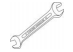
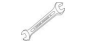
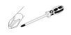
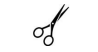
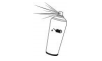
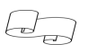

[< К содержанию](./readme.md)

## ВНИМАНИЕ!
---
1. **Проверьте вид и целостность деталей в упаковке!** Претензии по их повреждению принимаются только у изделий БЕЗ следов сборки.

2. **Сохраните упаковку до окончания сборки!** При выявлении в процессе сборки брака и некомплектности изделия необходимо сохранять упаковку до момента выезда к Вам представителя торговой компании.

3. Проверьте количество деталей и фурнитуры по перечню
Предприятие-изготовитель оставляет за собой право вносить конструктивные изменения в изделие, заменять фурнитуру и метизы на аналогичные, не ухудшающие внешний вид и не влияющие на функциональные свойства изделия.

4. **Соблюдайте порядок сборки, данный в этой инструкции!** При несоблюдении инструкций по сборке и
эксплуатации с компании-производителя снимаются гарантийные обязательства.

5. **Для установки дивана выбирайте ровный участок пола!** При искривлениях пола возможны отклонения в работе механизма трансформации дивана, перекосы формы изделия.

6. **Проводите сборку дивана вдвоём. Перемещайте все детали бережно, без рывков, укладывайте устойчиво, избегайте их падений и ударов!**

7. **Передвигайте мебель и её детали, только слегка приподнимая.** Это позволит исключить деформации и поломки.

8. **Обязательно смажьте механизм трансформации перед сборкой!** Это позволит избежать появления преждевременного скрипа металлического каркаса дивана

## для сборки мебели Вам понадобятся:
|Фото  | Наименование                           |  
|------------- | -------------                  |
|  | Ключ гаечный №10   |
|  | Ключ гаечный №13    |
| |   Отвертка крест   |
| |   Ножницы   |
| |   Рулетка   |
| |   Балон со смазкой   |
| |   Бумага для удаление излишней смазки   |