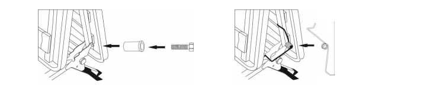

[< К содержанию](./readme.md)

## Cборка механизма трансформации

1. Поставьте механизм дивана на ножки, срежьте стяжки, удалите защитный ППУ и скотч.
2.  Разложите раму дивана. Совместите крайнее отверстие сбоку рамы изголовья с крайним отверстием опоры механизма.
3. Вставьте в это отверстие болт М6х65 шестигранный в сборе с пластиковой втулкой. Закрутите гайкой
М6 с внутренней стороны в полуразложенном состоянии механизма.
4. Наденьте ось пружины на пластиковую втулку, заведите усики пружины сначала за опору механизма,
затем за раму изголовья.
5. Проделайте те же операции для второй стороны механизма.

##  Смазка механизма трансформации.

1. Для качественной работы механизма рекомендуется при сборке и затем 1 раз в полгода смазать.
движущиеся соединения механизма трансформации бесцветной смазкой WD-40 или
силиконовой. Перед началом работы покрыть пол пленкой из упаковки дивана.
2. Нанесите смазку во все указанные на схеме точки.
3. После нанесения смазки, необходимо удалить её излишки бумажной салфеткой или бумажным полотенцем, чтобы избежать появления следов смазки на матрасе и элементах дивана.
4. Видео-инструкцией по смазке и обслуживанию дивана Вы можете ознакомиться на официальном сайте компании www.askona.ru в разделе «Покупателям», «Видеообзор продукции и услуг компании» или у специалистов горячей линии.

