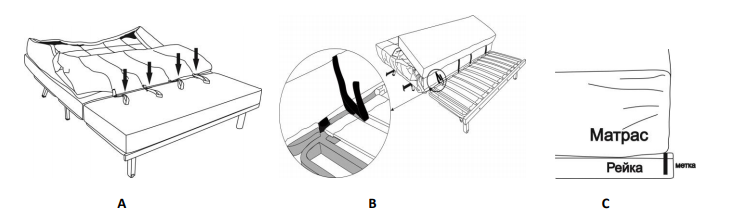
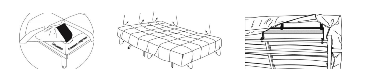
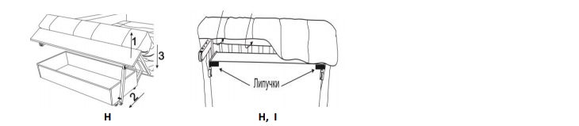

[< К содержанию](./readme.md)

## Крепление чехла дивана

1. Уложите чехол на матрас так, чтобы липучки на чехле совпали с прорезями на матрасе (прорези расположены между сиденьем и спинкой матраса). Проденьте липучки в прорези матраса.
2. Поднимите матрас с сиденья дивана и закрепите липучки чехла за металлическую раму СИДЕНЬЯ дивана между ближайшими латами, но НЕ ЗА ЛАТЫ. НЕ КРЕПИТЕ КОНТАКТНУЮ ЛЕНТУ С БОЛЬШИМ УСИЛИЕМ.
3. Опустите матрас сиденья и выровняйте его по планке на передней части рамы сиденья и меткам.

Снимите полосы защитной ткани по периметру чехла дивана.
4. Наденьте чехол на сиденье (угловую деталь на изнаночной стороне чехла необходимо направить на
боковую сторону дивана).
5. Равномерное распределите чехол по всему матрасу.
6. Прикрепите липучку чехла в изголовье дивана, огибая планку изголовья.
7. Прикрепите липучки чехла к матрасу по бокам дивана.

Приподнимите сиденье, открепите транспортировочные липучки бельевого короба, выдвиньте вперед ножку-подставку. Если нет бельевого короба подставьте под край сиденья стул.
8. Прикрепите липучку сиденья чехла к нижней стороне лат сиденья.
 Проверка посадки чехла дивана.
Сложите и разложите диван 2-3 раза, предварительно уперев изголовье в стену. СМ. последний раздел «ПОРЯДОК ТРАНСФОРМАЦИИ».
9. Разложите диван, спальное место должно иметь ровный вид. Если образуются складки, перекос, открепились липучки – исправьте положения чехла в проблемном месте, закрепив его заново.

