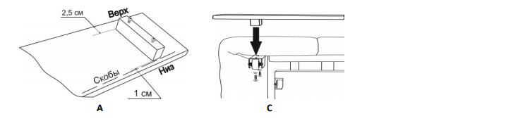

[< К содержанию](./readme.md)

 Утяжки чехла в месте сгиба сиденья должны быть одинаковой
глубины и не более 1-2 см глубиной. Если это не так, то поднимите
сиденье на ножку-подставку (при отсутствии стул) и
подтяните/ослабьте контактные ленты чехла под сиденьем дивана.

---

Если трансформация дивана затруднительна необходимо:
1. Проверить отсоединены ли липучки бельевого ящика, открепить чехол по бокам и перетянуть ткань матраса к месту его перегиба (СМ. п. 4B).
2. ослабить натяжение липучек матраса и чехла в месте сгиба сиденья (СМ. п. 6B).
B. Профиль спинки дивана в сложенном состоянии должен иметь небольшой полукруг. Если один из углов спинки дивана опущен больше, чем другой, то с этой стороны нужно подтянуть липучку крепления матраса за раму в изголовье дивана (СМ. п. 4С).

## Крепление царги дивана

Определите верх и низ царги. Выверните винты из царги.
1. Поднимите сиденье дивана на ножку-подставку (при отсутствии стул). Приложите царгу к передним ножкам механизма трансформации.
2. Совместите отверстия в передней ножке механизма и царге, вверните винты с шайбами через ножку механизма в царгу. Затяните винты крестовой отверткой до упора.

## Крепление клинового замка к подлокотникам

Если диван без канапе, то крепить замки нужно к обоим подлокотникам.
Если диван с канапе, то установить канапе можно на любую сторону.
1. Возьмите подлокотник, который необходимо установить с
противоположной от канапе стороны.
2. Определите верх замка, совместите крепежные отверстия замка с
крепежными отверстиями на внутренней части подлокотника.
3. Закрепите замок евровинтами М6х16.

## Крепление подлокотников

1. Для удобства крепления рекомендуется наполовину сложить
диван (не до фиксации) и немного ослабить крепления кронштейна с
опорой. Совместите крепежные отверстия подлокотника с отверстиями
кронштейнов. Со стороны кронштейнов вставьте в отверстия болты
М8х20 шестигранные и закрутите их в отверстия подлокотника.
Подтяните крепления кронштейна с опорой.
2. (При заказе дивана с канапе перейдите в раздел «Установка
канапе).