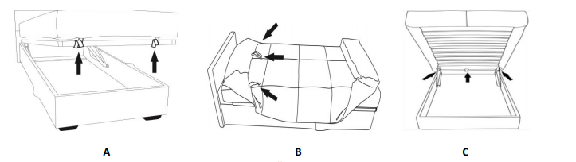

[< К содержанию](./readme.md)

## установка канапе(при заказе опции)

**крепление матраса секции канапе**

1. Уложите матрас на сиденье канапе. Выровняйте переднюю часть матраса по раме механизма, закрепите липучками за переднюю сторону рамы.
2. Накройте матрас чехлом, выровняйте на углах. Закрепите переднюю, затем боковые части чехла липучками к раме канапе.
3. Зафиксируйте 3-мя липучками заднюю часть чехла к раме канапе

## Крепление клинового замка к канапе.
1. Замок к канапе устанавливается к спинке канапе со
стороны модуля дивана.
2. Определите верх замка и совместите крепежные
отверстия замка с крепежными отверстиями на
боковой стороне канапе. Закрепите замок винтами
евро М6х16.
## Крепление диванного модуля и секции канапе.
1. Совместите крепежные отверстия кронштейнов
механизма трансформации и короба секции канапе.
2. С внутренней стороны короба канапе вставьте в
отверстия болты М8х70 шестигранные с предварительно
накинутыми шайбами 8 увеличенными.
Наденьте на болты круглые пластиковые проставки.
Вставьте болты в кронштейн механизма трансформации
и затяните гайками 8.
## Крепление подлокотника к секции канапе.
1. С внутренней стороны короба вставьте в крепежные
отверстия болты М8х70 с предварительно накинутыми
шайбами 8 увеличенными.
2. Наденьте на болты круглые пластиковые проставки и
закрутите болты в усовые гайки подлокотника.
